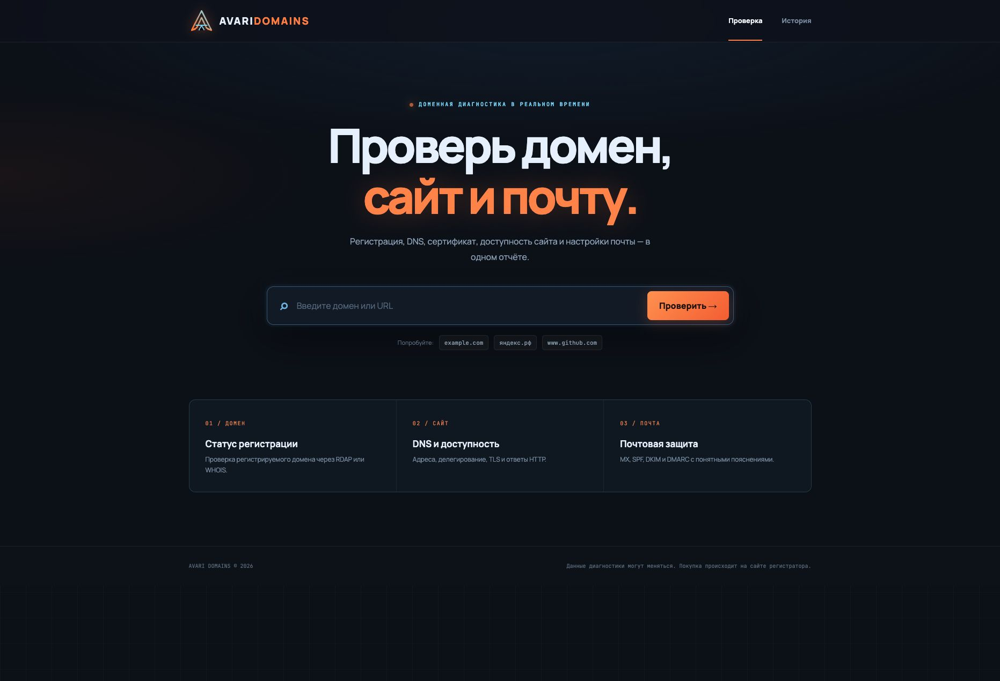
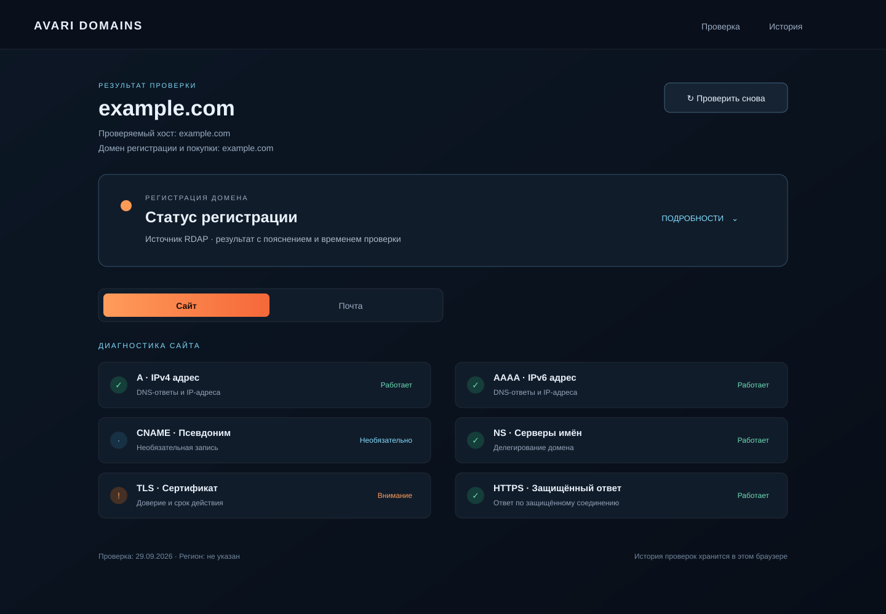

<div align="center">
  
  <h1>Avari Domains</h1>
  <p><strong>Диагностика домена, сайта, DNS, TLS и почты в одном понятном отчёте.</strong></p>
  <p>
    <a href="https://domains.avari.dev">Демо</a> ·
    <a href="README.md">English version</a> ·
    <a href="openapi.yaml">Спецификация API</a>
  </p>
  <p>
    
    
    
    
    
  </p>
</div>

## Интерфейс

| Проверка домена | Диагностический отчёт |
|:--:|:--:|
|  |  |

*Это статичные иллюстрации интерфейса. Пример отчёта показывает его структуру; реальные результаты зависят от домена и состояния сети.*

## Возможности

Avari Domains превращает домен или URL в практичный диагностический отчёт. Сервис отдельно определяет домен для проверки регистрации и хост для проверки сайта. Каждый результат сопровождается пояснением: ошибка или неполный ответ не выдаются за подтверждение доступности домена.

- **Регистрация:** проверка через RDAP с резервным WHOIS. Если ответ неоднозначен, статус остаётся неизвестным — домен не объявляется свободным без подтверждения.
- **Сайт и DNS:** записи A, AAAA, CNAME и NS, согласованность делегирования, TLS, HTTP и HTTPS.
- **Почта:** проверки MX, SPF, DKIM и DMARC с понятными пояснениями.
- **Сравнение регистраторов:** цены первого года и продления, источники и актуальность тарифов, ссылки на сайты регистраторов. Покупка происходит на стороне регистратора.
- **История в браузере:** список предыдущих проверок с постраничной навигацией и сводной статистикой.

## Технологии

- **Frontend:** React 19, TypeScript, Vite, TanStack Query и Framer Motion.
- **Backend:** HTTP-сервис на Go с параллельными проверками и контрактом OpenAPI 3.1.
- **Хранилище:** SQLite для кеша результатов и истории текущего браузера.
- **Развёртывание:** Docker Compose, раздача собранного frontend из Go, конфигурация OpenResty для VPS.

## Локальный запуск

### Docker Compose

```sh
docker compose up --build
```

Откройте [http://localhost:8080](http://localhost:8080). Данные SQLite хранятся в постоянном Docker volume. Состояние сервиса доступно по адресу `/api/health`.

### Режим разработки

Запустите backend из каталога `backend/`:

```sh
go run .
```

В отдельном терминале запустите frontend из каталога `frontend/`:

```sh
npm install
npm run dev
```

Vite перенаправляет `/api` на `localhost:8080`. В production Go раздаёт собранный каталог `frontend/dist`; при необходимости укажите другой путь через `STATIC_DIR`.

## Настройки

Приложение работает и без ключей регистратора. Необязательные переменные ниже включают проверку тарифов Porkbun для конкретного домена:

| Переменная | Назначение |
|---|---|
| `PORKBUN_API_KEY` | Ключ API Porkbun |
| `PORKBUN_SECRET_API_KEY` | Секретный ключ API Porkbun |
| `CHECK_REGION` | Регион проверки в результатах |
| `DNS_RESOLVER` | DNS-резолвер для запросов |
| `SQLITE_PATH` | Путь к базе SQLite |
| `LISTEN_ADDR` | Адрес HTTP-сервера |
| `STATIC_DIR` | Каталог собранного frontend |
| `TRUSTED_PROXY_IPS` | Адреса прокси, которым разрешено передавать IP клиента |

Значения по умолчанию указаны в `docker-compose.yml` и `backend/main.go`. Не добавляйте ключи API и production-файлы `.env` в репозиторий.

## API

HTTP API описан в [openapi.yaml](openapi.yaml). Основные маршруты:

- `GET /api/health` — состояние сервиса.
- `POST /api/check` — выполнить проверку или получить результат из кеша.
- `GET /api/history?page=0` — список проверок текущего браузера.
- `GET /api/history/{id}` — сохранённый отчёт текущего браузера.
- `GET /api/stats` — сводная статистика текущего браузера.

Частота запросов ограничена по IP. История хранится 90 дней, а срок кеширования результата зависит от статуса. При проверке сайта сервис подключается только к публичным IP-адресам и проверяет адреса после каждого редиректа.

## Структура проекта

```text
.
├── backend/                 Go API, проверки, хранилище SQLite
├── frontend/                Приложение React + TypeScript
├── docs/screenshots/        Иллюстрации интерфейса для README
├── deploy/                  Скрипты OpenResty и развёртывания VPS
├── docker-compose.yml       Локальный запуск и конфигурация контейнера
├── Dockerfile
└── openapi.yaml             Контракт API
```

## Лицензия

Проект распространяется по лицензии [MIT](LICENSE).
